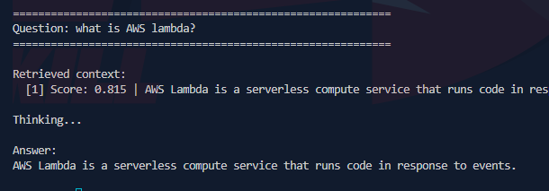
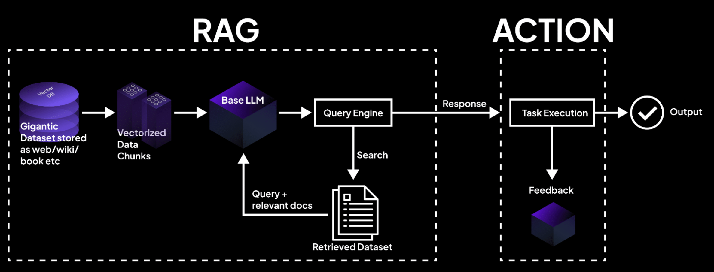

today's objective was very simple, i did not use heavy tech stack or deploy stuff ... no 
just a simple RAG, to understand how RAG works 
yes no hacking, no bad intention, pure pyhton 

# What is RAG ?? 

so first you may ask what is a RAG , and the answer is simple : **R**etrieval-**A**ugmented **G**eneration
RAG is an AI framework that combines information retrieval with text generation. Instead of relying solely on an LLM's training data, RAG first searches a knowledge base (your documents) and then uses that retrieved information to generate a cool answer , here is an example of what i did 


# RAG Architecture 



# The 2 main phases 

## Phase 1: Indexing (Preparation)

### Step 1: Gather Your Documents
You start with your dataset this could be anything: PDFs, internal wikis, web pages, books, or databases. These documents contain the knowledge you want the AI to use.

### Step 2: Split into Chunks
Documents are typically too large to feed directly into an LLM. So you break them into smaller pieces called "chunks." Each chunk might be a paragraph or a few sentences, usually around 200-500 words, Chunking makes it easier to find the exact piece of information relevant to a specific question.

### Step 3: Convert to Vectors
Each chunk is passed through an embedding model, which converts the text into a vector, a list of numbers that represent the semantic meaning of the text, The key property is that similar pieces of text end up with similar vectors. If two chunks are about the same topic, their vectors will be mathematically close to each other.

### Step 4: Store in a Vector Database
All these vectors are stored in a vector database along with their original text. This database is now your searchable knowledge base. You've essentially built an index that can be queried quickly.

## Phase 2: Query and Generation (Runtime)
This happens every time a user asks a question.

### Step 1: The User Asks a Question
A user submits a query, like "What is AWS Lambda?"

### Step 2: Convert the Question to a Vector
The same embedding model is used to convert the user's question into a vector.

### Step 3: Search for Similar Vectors
The query vector is compared to all the document vectors in the database using a mathematical measure like cosine similarity. This finds the chunks that are most similar in meaning to the question.

### Step 4: Retrieve the Top Results
The system retrieves the top K most relevant chunks (usually 3 to 5). These chunks become your "retrieved dataset"—the pieces of information that will help answer the question.

### Step 5: Build a Prompt with Context
The retrieved chunks are inserted into a prompt template. The LLM is instructed to answer the question based solely on this provided context. This prompt might look like: "Answer based ONLY on the context below. Context: [retrieved chunks]. Question: [user question]. Answer:"

### Step 6: The LLM Generates a Response
The prompt is sent to the LLM (in my case i used groq api), Because the LLM has the relevant context right in front of it, it can generate a response that is grounded in your documents not just based on its training data.

### Step 7: Return the Answer
The grounded answer is returned to the user, Since it came from your documents, it's accurate, verifiable, and up to date.

**for the doc i used in the code**

```py
DOCUMENTS = """AWS Lambda is a serverless compute service that runs code in response to events.
It automatically scales and you only pay for the compute time you consume.

Lambda functions can be triggered by S3 events, API Gateway requests, DynamoDB streams,
SNS notifications, CloudWatch Events, and EventBridge.

Key benefits of AWS Lambda:
- No server management
- Automatic scaling
- Pay-per-use pricing
- Integrated with many AWS services

Common use cases:
- Real-time file processing
- Web application backends
- Data transformation pipelines
- Chatbots and automation

AWS Lambda supports multiple programming languages:
Node.js, Python, Java, Go, C#, and Ruby.

Each Lambda function runs in an isolated environment.
You can configure timeout (up to 15 minutes) and memory (128MB to 10GB).
"""
```
i wanted to add more infos (more docs), but as i said i just wanted to test 

# Why RAG Matters?

let's talk a bit about LLMs and their limitations 
first the outdated knowledge, llms knows only what it was trained on and it needs to be retrained from time to time 
second hallucinations problem, cuz sometimes llms make things out without **context**
third, no private data access, so your internal docs cannot be accessed by the llm 
and so on ....
so here's is why RAGs comes into play
it will fix those issues with grounded answer and private access 

but i can see that, those advantages can be a good thing!! (obviously for an AI hacker)

## 🧪 My Implementation

I built a simple RAG system using:
- **Embedding Model:** sentence transformers (all-MiniLM-L6-v2)
- **Vector Search:** cosine similarity with scikit-learn
- **LLM:** groq API (Llama 3.1 8B)
- **Storage:** in memory NumPy arrays

The code chunks documents, converts them to vectors, and searches for relevant chunks when a question is asked.

# Where security comes into play

from all of this i've learned something so very crucial 
this whole architecture reveals a critical vulnerability: the vector database contains all your documents, and the LLM controls access!
boom... that's it
so if the vector database doesn't have proper authentication and authorization controls, an attacker can directly query it and retrieve every document in your knowledge base, This is a real world vulnerability that exists in many RAG deployments.

RAGs are interesting , not just in terms of security, but also in terms of other aspects , i don't know why i hated this feild before ? 

Anyway, I've talked enough for one report 

see you in the next one!

**happy AI hacking!** 🚀