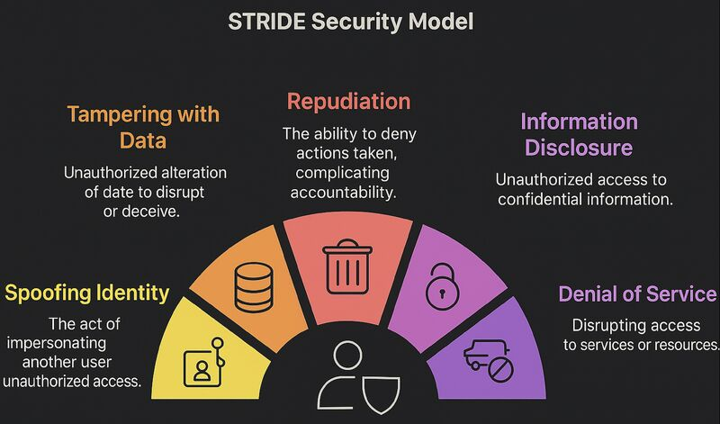

today i will be covering up some **threat hunting using STRIDE**

# first what is STRIDE ?
**STRIDE** is a framework for identifying and categorizing security threats, It stands for 6 types of threats that every system faces.
well in fact **STRIDE** was created by Microsoft in 1999 as part of their security lifecycle

S stands for spoofing 
T  stands for tampring
R stands for repudiation
I stands for Information Disclosure
D stands for Denial of Service
E stands for Elevation of Privilege



# Why is STRIDE Used?
the biggest prob is that security is overwhelming 
in fact, when you look at a system, there are infinite possible attacks. How do you know where to start? what is the solution to organize this chaos ?
STRIDE gives you 6 categories to think about, you know when you are throwing a party and you have a checklist that you should follow ...? 
yes it is the literal same thing but in AI safety context

# Why STRIDE is Valuable

1. **Structured**: thinking You don't miss anything.

2. **Common language**: Everyone understands the categories.

3. **Prioritization**: You know what to fix first.

4. **Documentation**: You can record and share findings.

# How i implemented the whole thing ? 

## First : identifying assets 

first question we should ask ourselves is **what are we protecting?**
in our case we are protecting 4 assets, Documents (i used one only to test), vector database (for embeddings), LLM access (groq API in our case), user data


## Second : asking the six questions

for each asset, we should ask the following questions 

```
Can someone pretend to be authorized for this asset?
Can someone modify this asset without permission?        
Can someone deny they interacted with this asset?
Can someone read this asset without permission?
Can someone make this asset unavailable?
Can someone get more access to this asset than they should?
```      

## Third : document mitigations

